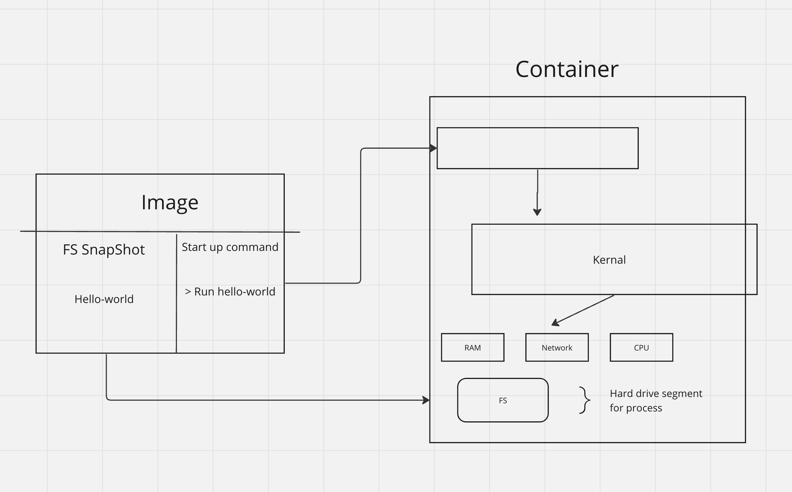

## How to run docker

basic command line launch

```bash
 π docker main ❯ docker run hello-world
Unable to find image 'hello-world:latest' locally
latest: Pulling from library/hello-world
478afc919002: Pull complete
Digest: sha256:53641cd209a4fecfc68e21a99871ce8c6920b2e7502df0a20671c6fccc73a7c6
Status: Downloaded newer image for hello-world:latest

Hello from Docker!
This message shows that your installation appears to be working correctly.

To generate this message, Docker took the following steps:
 1. The Docker client contacted the Docker daemon.
 2. The Docker daemon pulled the "hello-world" image from the Docker Hub.
    (arm64v8)
 3. The Docker daemon created a new container from that image which runs the
    executable that produces the output you are currently reading.
 4. The Docker daemon streamed that output to the Docker client, which sent it
    to your terminal.

To try something more ambitious, you can run an Ubuntu container with:
 $ docker run -it ubuntu bash

Share images, automate workflows, and more with a free Docker ID:
 https://hub.docker.com/

For more examples and ideas, visit:
 https://docs.docker.com/get-started/

 π docker main ❯
```

what this command did was download the docker image and then run that image in a container.

There are more ways of running the docker image:

**docker run \<image name\> command!**

```bash
 π docker main ❯ docker run busybox echo hi there
Unable to find image 'busybox:latest' locally
latest: Pulling from library/busybox
45d8eb5967de: Pull complete
Digest: sha256:c3839dd800b9eb7603340509769c43e146a74c63dca3045a8e7dc8ee07e53966
Status: Downloaded newer image for busybox:latest
hi there
 π docker main ✗ ❯

```

what if i run ls command?

```bash
 π docker main ❯ docker run busybox echo hi there
Unable to find image 'busybox:latest' locally
latest: Pulling from library/busybox
45d8eb5967de: Pull complete
Digest: sha256:c3839dd800b9eb7603340509769c43e146a74c63dca3045a8e7dc8ee07e53966
Status: Downloaded newer image for busybox:latest
hi there
 π docker main ✗ ❯
```

now when i run the command ls this is run in the busy box

## What is an image?

an image is combination of both FS snapshot and what command to run when the docker is launched

## List different containers to see whats running

Usually used to get the container id to run specific command on that container.

```bash
 π docker main ❯ docker run busybox echo hi there
Unable to find image 'busybox:latest' locally
latest: Pulling from library/busybox
45d8eb5967de: Pull complete
Digest: sha256:c3839dd800b9eb7603340509769c43e146a74c63dca3045a8e7dc8ee07e53966
Status: Downloaded newer image for busybox:latest
hi there
 π docker main ✗ ❯

 π docker main ✗ ❯ docker ps
CONTAINER ID   IMAGE     COMMAND             CREATED          STATUS          PORTS     NAMES
b394908e86c6   busybox   "ping google.com"   31 seconds ago   Up 31 seconds             dreamy_hermann
 π docker main ✗ ❯ docker ps
CONTAINER ID   IMAGE     COMMAND   CREATED   STATUS    PORTS     NAMES

 π docker main ✗ ❯ docker ps --all
CONTAINER ID   IMAGE         COMMAND             CREATED              STATUS                      PORTS     NAMES
b394908e86c6   busybox       "ping google.com"   About a minute ago   Exited (0) 17 seconds ago             dreamy_hermann
e2f16f5f77fa   busybox       "ls"                7 minutes ago        Exited (0) 7 minutes ago              objective_vaughan
8b17ce74a817   busybox       "echo hi there"     7 minutes ago        Exited (0) 7 minutes ago              zen_panini
7ff59f0616e3   hello-world   "/hello"            15 minutes ago       Exited (0) 15 minutes ago             distracted_bose
 π docker main ✗ ❯
```

### Life cycle of a container

**docker run = docker create + docker start**



- Creating the container just prep the FS on the container

- while starting the container is starting the start-up command

```bash
 π docker main ✗ ❯ docker create hello-world
47083fba3311143ef102668e02da9525ce39c0ec90acbec5e070229cb9f33a8c
```

This creates the container and prints out the ID of the container created

then to run we can run the below command with -a command

```bash
π docker main ✗ ❯ docker start -a 47083fba3311143ef102668e02da9525ce39c0ec90acbec5e070229cb9f33a8c

Hello from Docker!
This message shows that your installation appears to be working correctly.

To generate this message, Docker took the following steps:
 1. The Docker client contacted the Docker daemon.
 2. The Docker daemon pulled the "hello-world" image from the Docker Hub.
    (arm64v8)
 3. The Docker daemon created a new container from that image which runs the
    executable that produces the output you are currently reading.
 4. The Docker daemon streamed that output to the Docker client, which sent it
    to your terminal.

To try something more ambitious, you can run an Ubuntu container with:
 $ docker run -it ubuntu bash

Share images, automate workflows, and more with a free Docker ID:
 https://hub.docker.com/

For more examples and ideas, visit:
 https://docs.docker.com/get-started/

 π docker main ✗ ❯
```

When the conatiner is created we cannot repalce the default command

How to delete all containers

```bash
 π docker main ✗ ❯ docker system prune
WARNING! This will remove:
  - all stopped containers
  - all networks not used by at least one container
  - all dangling images
  - unused build cache

Are you sure you want to continue? [y/N] y
```

To get the logs of a container

```bash
 π docker main ✗ ❯ docker create busybox echo hi there
389f4371a0235f47cff768dd7bb4113a5ceae57b53079b3bebe168102f54c605

 π docker main ✗ ❯ docker start 389f4371a0235f47cff768dd7bb4113a5ceae57b53079b3bebe168102f54c605
389f4371a0235f47cff768dd7bb4113a5ceae57b53079b3bebe168102f54c605

 π docker main ✗ ❯ docker logs 389f4371a0235f47cff768dd7bb4113a5ceae57b53079b3bebe168102f54c605
hi there
 π docker main ✗ ❯
```

### docker kill vs docker stop

stop - is a graceful shutdown

kill - stop all processes immediately

```bash
 π docker main ✗ ❯ docker stop 6d9c3d059da60b00634c0d505d4cdf9a4384dc827d798d226981ea1339b24ced
6d9c3d059da60b00634c0d505d4cdf9a4384dc827d798d226981ea1339b24ced
 π docker main ✗ ❯ docker ps --all
CONTAINER ID   IMAGE     COMMAND             CREATED              STATUS                       PORTS     NAMES
6d9c3d059da6   busybox   "ping google.com"   About a minute ago   Exited (137) 6 seconds ago             amazing_bell
389f4371a023   busybox   "echo hi there"     2 minutes ago        Exited (0) 2 minutes ago               hardcore_turing
 π docker main ✗ ❯
```
